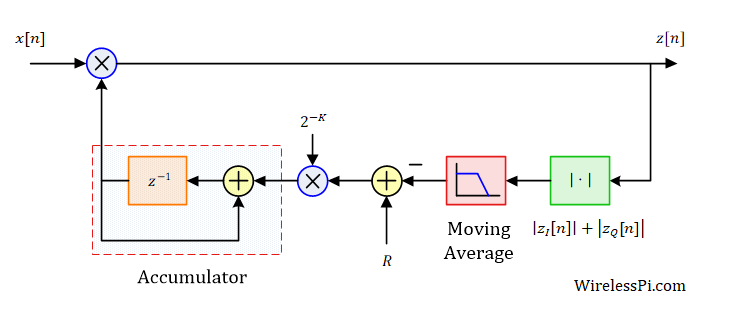
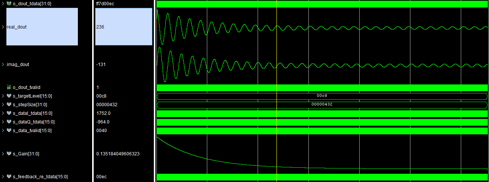

# AGC
This repository contains an implementation of a digital AGC (Automatic Gain Control) using MATLAB and VHDL.
 The AGC is implemented based on the following resource:
 https://wirelesspi.com/how-automatic-gain-control-agc-works/ 

  

# How to build 
1. **Open Vivado** –> Launch the Xilinx Vivado software.<br>
2. **Access the TCL Console** –> Locate the TCL console at the bottom of the Vivado interface.<br>
3. **Navigate to the Build Folder** –> Use the cd command to move to the project's build directory.<br>
4. **Run the Build Command** –> Execute the following command in the TCL console:

```tcl 
cd ./FPGA/build
source vivado_build2.tcl 
```

# Test Bench verification
A test bench file is included in the project. You can run it to verify the functionality.
The following image demonstrates the AGC's operation, where an input signal ranging from -2000 to 2000 is scaled down to an output range of -200 to 200:




The AGC's target power level is defined by the `targetLevel` parameter, which is implemented as a fixed-point number with:

 * 16-bit integer part

 * 0-bit fractional part (pure integer representation)

In this implementation, the targetLevel is set to hex(200) (which corresponds to 512 in decimal).

``` python 
targetLevel = 0x200  # 512 in decimal, no fractional bits  
```

# Simulation 
The project includes a MATLAB simulation file located in the matlab folder. You can run this file to analyze the AGC's behavior and verify its performance.


